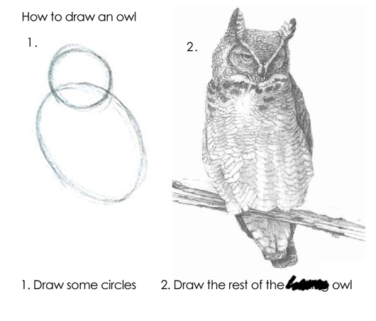

##### Sources  
Thomas Lumley, Github repo [useRfasteR](https://github.com/tslumley/useRfasteR)  
Hadley Wickham, [Profiling](http://adv-r.had.co.nz/Profiling.html), *Advanced R*  
Dirk Eddelbuettel, [Rcpp](http://www.rcpp.org/)  

#### The Process for Improving Code:
(quote from *Advanced R*)

>1. Find the biggest bottleneck (the slowest part of your code).
>2. Try to eliminate it (you may not succeed but that’s ok).
>3. Repeat until your code is “fast enough.”

__Easy peasy, right???__



#### Some general guidelines for speeding up R code

1. Use data frames less - they are expensive to create, often copied in whole when modified, and their rownames attribute can really slow things down.
1. Be wary of using functions that copy objects in whole: c(), append(), cbind(), rbind(), or paste(). When used in loops, you can get a massive proliferation of objects in memory.
1. Use vectorised functions:
    * apply, lapply, sapply, vapply, tapply, mapply
    * rowSums, colSums, rowMeans, colMeans, cumsum, diff
1. Base functions are designed to handle wildly different input. Consider rewriting base functions for highly repetitive tasks.
1. Use parallel::mclapply for parallelising functions.
1. Consider an optimized matrix algebra library (beyond BLAS) for better performance (e.g. [Apple vecLib BLAS](https://developer.apple.com/documentation/accelerate/blas), [openBLAS](https://www.openblas.net/)).
1. If you work with sparse matrices, use tools for them like the package 'Matrix'.  
1. For huge objects, consider storing the information in a database and accessing it with 'dbplyr'. The packages 'dbglm' and 'tidypredict' will also do model fitting with data inside a database.
1. Another solution for large objects are specialized formats like [HDF5](https://portal.hdfgroup.org/display/support) or [netCDF](https://www.unidata.ucar.edu/software/netcdf/).
1. Take advantage of the Rcpp suite of programs - not just for C/C++ programmers (e.g. RcppArmadillo::fastlm).
1. Use an alternative implementation of R (e.g., [fastR](https://github.com/oracle/fastr]), [pqR](http://www.pqr-project.org/)).
1. Check your code with benchmarking!!!

#### Let's do some benchmarking!
Important: don't (re)install 'compiler'; you should just be able to load it in R v3.5 and later.
```{r}
pck <- c("pryr","microbenchmark", "profvis", "compiler", "mnormt")
invisible(lapply(pck, library, character.only = T))
```

First, Turn off the just-in-time compiler. Note that return value is what the JIT was set at previously (default = 3).
```
enableJIT(0)
```

##### The microbenchmark function
* for evaluating small snippets of code
* below is a comparison of several approaches to calculating a mean

```{r}
a <- function() {
  m <- sample(1:100, 2)
  data.x <- lapply(m, function(x) rnorm(1e4, mean = x))
  do.call("cbind", data.x)
}

some_data <- a()
dim(some_data)

microbenchmark(
  mean_loop = apply(some_data, 2, mean),
  mean_vec = colMeans(some_data),
  mean_manual = apply(some_data, 2, function(x) sum(x)/length(x)),
  mean_manual_ultra = apply(some_data, 2, function(x){
    total = 0
    n = 0
    i = 1
    while(!is.na(x[i])) {
      total = total + x[i]
      n = n+1
      i = i+1
    }
    total/n
  })
)
```

##### Prevent multiple dispatch:
* the function mean() is meant to handle several different types of data
* specifying the method (thus implying a certain type of input) can speed up the process for small data sets
* the function mean() calls a different function depending on the object specified:

```{r}
methods(mean)

x1 <- list(e2 = runif(1e2), e4 = runif(1e4), e6 = runif(1e6))

lapply(x1, function(x)
  microbenchmark(
    mean(x),
    mean.default(x)
  )
)
```
I suspect the improvement in speed for smaller objects but larger objects is related to big O notation -- these smaller objects are impacted by constants

Other approaches for finding source code:

```{r}
# tracking package type, etc
otype(mean)
ftype(mean)
showMethods(mean) #for S4
methods(mean)
```
The function methods() does not always work, but there are alternatives:
```{r}
methods(var)
getAnywhere(var)
```

##### Find the bottlenecks with Rprof()
* writes stack calls to disk along with memory usage and vector duplication
* you create a .prof file to do this and then close it when done with profiling

```{r}
Rprof("permute.prof", memory.profiling = T)

sigma.mv <- diag(1, nrow = 5, ncol = 5)
sigma.mv[upper.tri(sigma.mv)] = 0.5
sigma.mv[lower.tri(sigma.mv)] = 0.5

mvn.data <- rmnorm(1e3, mean = rep(0, 5), varcov = sigma.mv)
colnames(mvn.data) <- c(paste0("x",1:5))

kmeans.Ftest <- function(kmean_obj) {
  df.1 = length(kmean_obj$size) - 1
  df.2 = length(kmean_obj$cluster) - length(kmean_obj$size)
  betw_ms <- kmean_obj$tot.withinss/df.1
  with_ms <- kmean_obj$betweenss/df.2
  fratio = betw_ms/with_ms
  pval <- pf(fratio, df1 = df.2, df2 = df.1, lower.tail = F)
  stuff = c(fratio, df.1, df.2, pval)
  names(stuff) <- c('F-ratio', 'df 1','df 2', 'p-value')
  return(stuff)
}

kmeans.optimiz <- lapply(2:10, function(x) {
    results = kmeans(mvn.data, centers = x, nstart = 15, algorithm = "MacQueen",
                        iter.max = 50)
    kmeans.Ftest(results)
})

kmeans.final <- do.call("rbind", kmeans.optimiz)

Rprof(NULL)
summaryRprof("permute.prof") #, memory = "both")
```

##### Use profvis to visualize performance
* nice graphical output  
* native in RStudio (there is extensive [documentation](https://support.rstudio.com/hc/en-us/articles/218221837-Profiling-with-RStudio))  
* you can view output in browser

```{r}
p <- profvis({
mean_loop = apply(some_data, 2, mean)
mean_vec = colMeans(some_data)
mean_manual = apply(some_data, 2, function(x) sum(x)/length(x))
mean_manual_ultra = apply(some_data, 2, function(x){
  total = 0
  n = 0
  i = 1
  while(!is.na(x[i])) {
      total = total + x[i]
      n = n+1
      i = i+1
    }
    total/n
  })
})
htmlwidgets::saveWidget(p, "profile.html")

browseURL("profile.html")
```

##### Explore source code

__How to access function source code__
(if you didn't write the function yourself)

1. Type the function name (without parentheses): `eigen`
1. Find namespace and methods associated: `methods("princomp"); getAnywhere("princomp.default")`
1. Use pryr::show_c_source() to search for C code on GitHub (which may or may not be helpful)
1. Download the entire package and explore the code

```{r}
svd
La.svd

try(show_c_source(.Internal(La_svd(x))))
show_c_source(.Internal(mean(x)))

download.packages("broman", repos = "https://cloud.r-project.org",
  destdir = getwd(),type = "source")
```

##### Trace objects copied
* use tracemem() to track particular objects

```{r}
a <- letters[sample(10)]
tracemem(a)
a[1] <- "Z"
b <- a[1:5]  # not copied
```

##### Memory
* How much memory is being used? Note that R requests memory from your computer in big chunks then manages it itself.

```{r}
mem_used()
object.size(x1) #base
object_size(x1) #pryr
compare_size(x1) #between base R and pryr
```

Read the [documentation for pryr functions](https://www.rdocumentation.org/packages/pryr/versions/0.1.4) for more useful functions.

Now that we are all done, turn the JIT compiler back on:
```{r}
enableJIT(3)
```
##### More Tips from *Advanced R*
These are designed to reduce internal checks

1. read.csv(): specify known column types with colClasses.  
1. factor(): specify known levels with levels.  
1. cut(): don't generate labels with labels = FALSE if you don't need them, or, even better, use findInterval().  
1. unlist(x, use.names = FALSE) is much faster than unlist(x).  
1. interaction(): if you only need combinations that exist in the data, use drop = TRUE.  


### Remember!


[xckd comic](https://xkcd.com/1205/)

