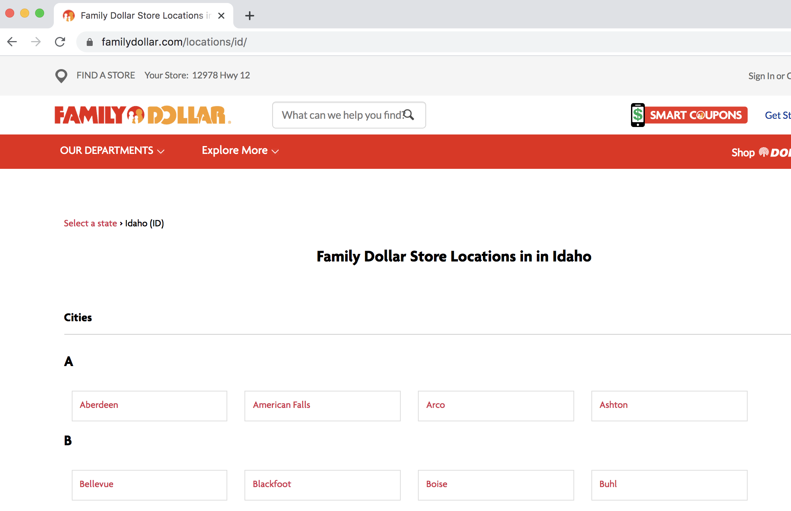
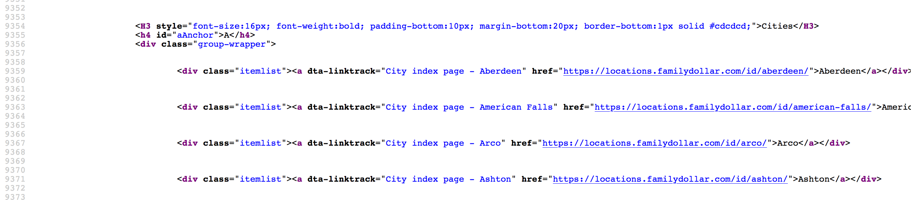
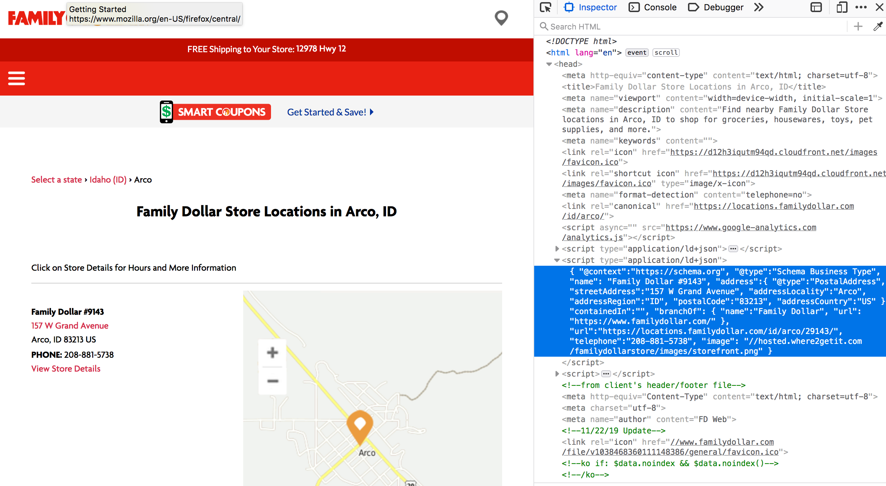
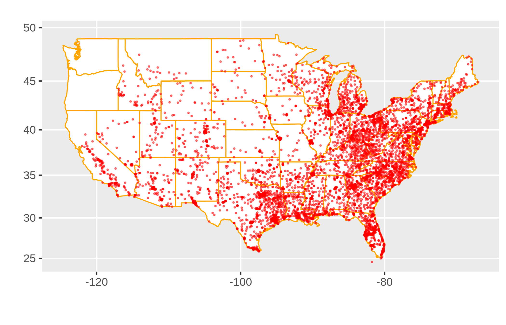

*This is adapted from a talk I gave at Pycascades in Portland, Oregon 2020-02-09.*

All the resources from this talk are available at my [GitHub repo](https://github.com/jpiaskowski/pycas2020_web_scraping). 

```{r echo=F}
library(reticulate)
use_python("/usr/bin/python3")
# virtualenv_create("pycas2020")
# a few things you might need to install if you are calling Python from R
# py_install(c("requests", "json", "pandas", "DataFrame"))
# py_install(c("bs4", "Tag"))
use_virtualenv("pycas2020")
```

### Introduction

#### Here is a Great Way to Learn Python!


But in truth, who actually reads these A to Z?? (spoiler: not me) Many people find these instructional books useful, but as a new Python user, I do not typically read this books front to back. I learn by doing a project, struggling, figuring some things out, and then reading a book like that! (it's probably time I read that book, actually). 

 <figure>
  
  <figcaption>me and my programming books</figcaption>
</figure> 

This post provides a guide to my first scraping project in Python. It is very low on assumed knowledge in Python and html. This is intended to be a guide into how to access web page content with the library **requests** and parse the content using **BeatifulSoup4**, as well as **json** and **pandas**. I will briefly introduce **Selenium**, but I will not delve deeply into how to use that library (that topic deserves its own tutorial). I hope to show you some tricks and tips to make web scraping less overwhelming. 

####  The Main Requirements for a Successful Web Scraping Project: 

* Information that is worth the effort it takes to build a working web scraper
* Information that can be legally and ethically gathered by a web scraper
* The tools available in the libraries `BeautifulSoup` and `requests` 
* Knowledge on how to find the target information in html code
* Knowledge on how to parse json objects (I will use `json` in this tutorial). 
* Rudimentary `pandas` skills

**A comment on html:**

While html is the beast than runs the internet, what we mostly need to understand is how tags work. A tag is a collection of information sandwiched between angle-bracket enclosed labels. Here is my pretend tag, called "pro-tip": 

`<pro-tip> All you need to know about html is how tags work </pro-tip>`
 
We can access the information in there ("All you need to know...") by calling its tag, "pro-tip". How to find and access a tag will be addressed further in this tutorial.  

#### What to Look for in a Scraping Project: 

1. No public API is available for the data. This would be much easier to use and would help clarify both the legality and ethics of gathering the data. 
1. There needs to be a sizable amount of structured data with a regular repeatable format to justify this effort. Web scraping can be a pain. **BeautifulSoup** makes this easier, but there is no avoiding the individual idiosyncrasies of websites that will require customisation. 
1. Identical formatting of the data is not required, but it does make things easier The more "edge cases" (departures from the norm) present, the more complicated the scraping will be. 


#### Legal & Ethical Considerations 
*(note: I have zero legal training - this is not legal advice!)*

Accessing vast troves of information can be intoxicating.   
  
*Just because it's possible doesn't mean it should be done*

Most websites have a [robots.txt](https://www.contentkingapp.com/academy/robotstxt/) file associated with the site indicating which scraping activities are permitted and which are not. It's largely there for interacting with search engines (the ultimate web scrapers). However, much of the information on websites is considered public information. As such, some consider the robot.txt file as a set of *instructions* rather than a legally binding document. The robots.txt file does not address topics such as ethical gathering and usage of the data. 

Questions I ask myself before before beginning a scraping project: 

* Am I scraping copyrighted material? 
* Will my scraping activity compromise individual privacy?
* Am I making a large number of request that may overload or damage a server?
* Is it possible the scraping will expose intellectual property I do not own?
* Are there terms of service governing use of the website and am I following those? 
* Will my scraping activities diminish the value of the original data? (for example, do I plan to repackage the data as is and perhaps siphon off website traffic from the original source?)

When I scrap a site, I make sure I can answer "No" to all of those questions.

**Other resources on this Subjecy:**

* [Krotov and Silva, 2018](https://www.researchgate.net/publication/324907302_Legality_and_Ethics_of_Web_Scraping)
* [Sellars 2-18](https://papers.ssrn.com/sol3/papers.cfm?abstract_id=3221625)


### Now It's Time to Scrape!

My goal was to extract addresses for all Family Dollar stores in Idaho. These have an out sized presence in rural areas, so I wanted to understand how many there are in Idaho and their locations. 




The starting point: https://locations.familydollar.com/id/

#### Step 1: Load the Libraries

```{python}
import requests # for making standard html requests
from bs4 import BeautifulSoup # magical tool for parsing html data
import json # for parsing data
from pandas import DataFrame as df # premier library for data organization
```

#### Step 2: Request Data from Target URL

```{python}
page = requests.get("https://locations.familydollar.com/id/")
soup = BeautifulSoup(page.text, 'html.parser') 
```

Beautiful Soup will take html or xml content and transform it into a complex tree of objects. Here are several common object types: 

* `BeautifulSoup` - the soup (the parsed content)  
* `Tag`  - a standard html tag, the main type of bs4 element you will encounter 
* `NavigableString` - a string of text within a tag  
* `Comment` - special type of NavigableString

**More on** `requests.get()` **output:**

I've only used `page.text()` to translate the requested page into something readable, but there are other output types:  

* `page.text()` for text (most common)
* `page.content()` for byte-by-byte output 
* `page.json()` for json objects
* `page.raw()` for the raw socket response (no thank you)

I have only worked on English-only sites using the Latin alphabet. The default encoding settings in **requests** have worked fine for that. However, there is a rich rich internet world beyond English-only sites. To ensure that **requests** correct parses the content, you can set the encoding for the text:

```
page = requests.get(URL)
page.encoding = 'ISO-885901' 
soup = BeautifulSoup(page.text, 'html.parser') 
``` 
 
**More on BS4 tags:*

* The bs4 element 'tag' is capturing an html tag
* it has both a name and attributes that can be accessed like a dictionary: `tag['someAttribute']`
* if a tag has multiple attributes with the same name, only the first instance is accessed
* a tag's children is accessed via `tag.contents`
* all tag descendants can be accessed with `tag.descendants`
*  you can always access the full contents as a stringwith: `re.compile("your_string")` instead of navigating the html tree. 

#### Step 3: Determine How to Extract Relevant Content from bs4 Soup

*This process can be frustrating.*    


This can be a daunting process filled with missteps. I think the the best way to approach this is start with one representative example and then scale up (this principle is true for any programming task). Viewing the page's html source code is essential. There are a number of way to do this. 

You can view the entire source code via Python in your IDE (not recommended). Run this code at your own risk: 

```{Python, eval=F, echo=T}
print(soup.prettify())
```

While printing out the *entire source code* for a page might work for a toy example shown in some tutorials, most modern websites have an massive amount of content on any one of their pages. Even the 404 page is likely to be filled with code for headers, footers and so on. 

It is usually easiest to browse the source code via "View Page Source" (right-click --> "view page source"). That most actually the most reliable way find your target content (I will explain why later in this tutorial). 



In this instance, I need to find my target content - an address, city, State and zip code - in this vast html ocean. Often, a simple search of the page source (ctrl + F) will yield the section where my target location is located. Once I actually can see an example of my target content (the address for at least one store), I look for an attribute or tag that sets this content apart from the rest. 

It would appear that first, I need to collect web addresses for different cities in Idaho with Family Dollar Stores and visit those websites to get the address information. These web addresses all appear to be enclosed in a 'href' tag. Great! I will try searching for that using the `find_all` command:

```{python}
dollar_tree_list = soup.find_all('href')
dollar_tree_list
```

Searching for 'href' did not yield anything (darn). This might have failed because 'href' is nested inside the class 'itemlist'. For the next attempt, search on 'item_list'. Because "class" is a reserved word in Python, `class_` is used instead. The bs4 function `soup.find_all()` turned out to be the Swiss army knife of bs4 functions. 

```{python}
dollar_tree_list = soup.find_all(class_ = 'itemlist')
for i in dollar_tree_list[:2]:
  print(i)
```

Anecdotally, I found that searching for a specific class was often a successful approach. Here is more information on that object:

```{Python, collapse=TRUE}
type(dollar_tree_list)
len(dollar_tree_list)
```
 
The content from this BeautifulSoup "ResultSet" can be extracted using `.contents`. This is also a good time to create a single representative example. 

```{python}
example = dollar_tree_list[2] # a representative example
example_content = example.contents
print(example_content)
```

Use `.attr` to find what attributes are present in the contents of this object.

*Note: `contents` usually return a list of exactly one item, so the first step is to index that item.*

```{python}
example_content = example.contents[0]
example_content.attrs
```

Now that I can see that 'href' is an attribute, that can be extracted like a dictionary item: 
```{python}
example_href = example_content['href']
print(example_href)
```

#### Step 4: Put it all together: 

```{python}
city_hrefs = [] # initialise empty list

for i in dollar_tree_list:
    cont = i.contents[0]
    href = cont['href']
    city_hrefs.append(href)

#  check to be sure all went well
for i in city_hrefs[:2]:
  print(i)
```

**Result:** a list of URL's of Family Dollar stores in Idaho to scrape. 

#### Repeat Steps 1-4 for the City URLs

I still don't have address information! Now, each city URL needs to scraped to get this information. So, restart the process, using a single, representative example. 

```{python}
page2 = requests.get(city_hrefs[2]) # again establish a representative example
soup2 = BeautifulSoup(page2.text, 'html.parser')
```



The address information is nested within 'type="application/ld+json"'. After doing a lot of geolocation scraping, I've come to recognize this as a common structure for storing address information. Fortunately, `soup.find_all()` also enables searching on 'type'. 

```{python}
arco = soup2.find_all(type="application/ld+json")
print(arco[1])
```

The address information is in the second list member! Finally!

I extracted the contents (from the second list item)  using `.contents` (this is a good default action after filtering the soup). Again, since the output of contents is a list of length one, I indexed that list item:

```{python}
arco_contents = arco[1].contents[0]
arco_contents
```

Wow, looking good. The format presented here is consistent with the json format (also the type did have "json" in its name). A json object can act like a dictionary with nested dictionaries inside. It's actually a nice format to work with once you become familiar with it (and it's certainly much easier to program than a long series of regex commands). Although this structurally looks like a json objects, it is still a bs4 object and needs a formal programmatic conversion to json to be accessed as a json object:

```{python}
arco_json =  json.loads(arco_contents)
```

```{python, linewidth=85}
type(arco_json)
print(arco_json)
```

In than content is key called 'address' that has the desired address information in smaller nested dictionary. This can be retrieved as thus:

```{python, linewidth=70}
arco_address = arco_json['address']
arco_address
```

#### Step 5: Finally, Put It All Together

Iterate over the list store URLs in Idaho:

```{python}
locs_dict = [] # initialise empty list

for link in city_hrefs:
  locpage = requests.get(link)   # request page info
  locsoup = BeautifulSoup(locpage.text, 'html.parser') 
      # parse the page's content
  locinfo = locsoup.find_all(type="application/ld+json") 
      # extract specific element
  loccont = locinfo[1].contents[0]  
      # get contents from the bs4 element set
  locjson = json.loads(loccont)  # convert to json
  locaddr = locjson['address'] # get address
  locs_dict.append(locaddr) # add address to list
```

Do some final data organisations steps: convert to a pandas data frame, drop the unneeded columns "@type" and "country") and check the top 5 rows to ensure that everything looks alright. 

```{python}
locs_df = df.from_records(locs_dict)
locs_df.drop(['@type', 'addressCountry'], axis = 1, inplace = True)
locs_df.head(n = 5)
```

**Results!!**

 <figure>
  
  <figcaption>They are also euphoric about these results!</figcaption>
</figure>

Make sure to save results!! (still euphoric)
```{Python, eval=F, echo=T}
df.to_csv(locs_df, "family_dollar_ID_locations.csv", sep = ",", index = False)
```

### A Few Words on Selenium

(using Walgreens as an example)

"Inspect Element" provides the code for what is displayed in a browser:


 
While "View Page Source" - provides the code for what **requests** will obtain:


When these two don't agree, there are plugins modifying the source code - so, it should be accessed *after* the page has loaded in a browser. **requests** cannot do that, but **Selenium** can. 

Selenium requires a web driver to retrieve the content. It actually opens a web browser, and this page content is collected. Selenium is powerful - it can interact with loaded content in many ways (read the documentation). After getting data with **Selenium**, continue to use **BeautifulSoup** as before: 

```{Python, eval=F, echo=T}
url = "https://www.walgreens.com/storelistings/storesbycity.jsp?requestType=locator&state=ID"
driver = webdriver.Firefox(executable_path = 'mypath/geckodriver.exe')
driver.get(url)
soup_ID = BeautifulSoup(driver.page_source, 'html.parser')
store_link_soup = soup_ID.find_all(class_ = 'col-xl-4 col-lg-4 col-md-4') 
```

### In Conclusion...

**Be Patient**


**Consult the Manuals**

(these are very helpful)

* https://beautiful-soup-4.readthedocs.io/en/latest/  
* https://selenium.dev/  

 <figure>
  
  <figcaption>~  You, After Becoming a Web Scraping Master ~</figcaption>
</figure>

*Postscript:*  It turns out very few people nowadays have seen "Adventures in Babysitting" and get this reference in this post title. That's okay. To summarise: while a woman babysits 3 charges for an evening, everything goes catastrophically wrong. Yet, somehow she get everyone home unharmed and have some fun adventures along the way. That felt like an apt metaphor for building these scripts. They take considerable attention, but with careful work, you can build a highly functional web scraper. 

*Post Postscript:*  

 <figure>
  
  <figcaption>Dollar Stores in America</figcaption>
</figure>

There are many many dollar stores in America. 