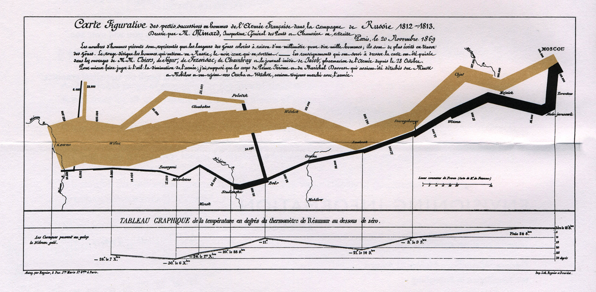

#### Top Lessons from R users conference held July 10 - 13 in Brisbane, AUS

With 900 registrants and dozens of talks, there is much to report ([videos of most talks](https://www.youtube.com/channel/UC_R5smHVXRYGhZYDJsnXTwg/videos) provided by R Consortium YouTube channel) I'll skip loads of it and just focus on the top 10 cool stuff.

1. The hex wall was just straight up cool. Here's the [code for that](https://blog.mitchelloharawild.com/blog/user-2018-feature-wall/).

1. I participated in a half day workshop on Rcpp ([here](https://www.youtube.com/watch?v=FZ0LcJbxPF0) and [here](https://www.youtube.com/watch?v=EXGhR-kyjRg)). This continues to be a very popular suite of packages to help users increase the speed and efficiency of their programs. I say "suite" because in addition to 3 major functions provided by Rcpp, a number of accessory packages have been written to extend its functionality. Several of these accessory packages essentially are providing templates for invoking C++ commands without having to actually know C. Dirk Eddelbuttel introduced the 3 major functions for extending R with C/C++:
  * evalCpp: for evaluating ad hoc anonymous expressions
  * cppFunction: standard function written in C/C++ and invoked in a program
  * sourceCpp: source C/C++ objects & functions from external file
These functions must be compiled each time a fresh R session is started. Building an Rcpp package avoids this and is easy to do:
```
Rcpp.package.skeleton("mypackage")
```  
1. The other useful workshop I participated in was methods for speeding up R, delivered by Thomas Lumley, formerly of UW and now of U of Auckland. He focused on a few major recommendations:

  - Vectorise whenever possible. This also implies that you know your vectorised functions:
      * lapply/apply/sapply/vapply/tapply
      * rowMeans, rowSums
      * colMeans, colSums
      * Consider parallelised functions: mclapply

  - Base functions are often designed to handle wildly different input. It may make sense in some instances to rewrite functions, making assumptions (e.g. about the input data) that fit your circumstances.

  - Data frames should be avoided if possible - they are expensive to create and often copied in whole when modified.

  - Using an optimized matrix algebra library (not LAPACK) may be worth the time to install that. These libraries have optimized how data is accessed from disk.

  - Some rec's on how to handle large objects that reasonably don't fit in memory:

    - buy a computer with more memory (not always a reasonable option)
    - put your data in database and access with tools like dbplyr. One recommendation is MonetDBLite, a column-optimized database good for scientific applications for that reason.
    - Use special file formats for bigger data sets: HDF5, GitLFS

  - But, first and foremost, he emphasized the use of profiling tools and benchmarking functions. find out where the bottleneck in your program actually are! And be careful to not waste too much time on optimizing code - time saved may not be worth time invested. R is automatically running a JIT (just in time) compiler that makes code run faster each time it is called. It makes sense to turn this off while doing benchmarking:

  ```
  enableJIT(0)

  # to turn back on:

  enableJIT(1)
  ```

  Course notes available on his github repo [UseRfasteR](https://github.com/tslumley/useRfasteR).

1. Excellent keynotes all-around. [Steph da Silva](https://www.youtube.com/watch?v=27FxbDtCFoc) emphasized the importance of *community* in open-source community - what that can look like, how to contribute  how your contribution helps develop camaraderie to support sharing of code and development of analysts.

1. [Roger Peng discussed development of R](https://www.youtube.com/watch?v=5033jBHFiHE) as it strives to fit both programmers and regular ole scientists analyzing their data. He summarized his own talk quite well in this essay. He described the rise of "worse is better", that is, the simplying of options in R to make it easier for new users to learn. The tidyverse is considered such an example. However, as a long-time user, I find dplyr's group-and-summarise options (among others) to be incredibly handy. And I will never go back to using reshape() now that we have gather() and spread(). Even reshape2() is a massive improvement in usability!

1. Jenny Bryan's talk on ["Code Smells and Feels"](https://youtu.be/7oyiPBjLAWY ) provided a great introduction to how to identify and fix poorly written code. According to [Wikipedia](https://en.wikipedia.org/wiki/Code_smell), "Code smells are usually not bugs; they are not technically incorrect and do not prevent the program from functioning. Instead, they indicate weaknesses in design that may slow down development or increase the risk of bugs or failures in the future."
Based on the book, *Refactoring: Improving the Design of Existing Code*, she gave a few simple directives to create simple code that is easy to understand, debug, and maintain. Hooray!
  - Hoist entry or exit conditionals to the top of functions
  - Use functions as much as possible
  - Avoid overly nested code (e.g. a long cascade of nested "if" statements)
  - Not every "if" needs an else
  - Consider implementing true object-oriented programming when working with classes
  - Don't' be afraid to write short helper functions
There was also a brief discussion on how to tell a person their code smells bad ("that's what we have funny names like 'excessive use of literals'").  

1. Excellent set of talks on data handling and workflow. In particular, [a talk on the website builder](https://www.youtube.com/watch?v=GrqM2VqIQ20) for documenting data analysis called ["workflowr"](https://github.com/jdblischak/workflowr). [Discussion on consistent workflows](https://www.youtube.com/watch?v=IYfZ6kd7aT0), recommended conventions for naming variables, creating consistent set of directories for each project, using version controls. Obvious to a data scientist, but rarely used by regular scientist. This resonates strongly with me due to ongoing issues with data management in the agricultural sciences.

1. [Excellent talk on precision in R](https://www.youtube.com/watch?v=3Bu7QUxzIbA). Use .Machine to find out more, but basically R is only good to 16 decimal points. Subtraction of one number similar to it can result in cancellation where the result essentially slides to zero, losing precision. Ways to avoid this include working in log space, perhaps adding a zero if needed: log(x + 1), -log(1 - exp(x)). Also, there is the [Rmpfr package](https://cran.r-project.org/web/packages/Rmpfr/index.html).

1. [Glue package](https://www.youtube.com/watch?v=XQmBcpQl8K8) - for "gluing" strings to data, like string interpolation in bash ("$") or python f"{...}". R does have sprintf() with with identical functionality to C's printf(), but glue makes this easier.

1. [Fun talk on vwline package](https://www.youtube.com/watch?v=L6FawdEA3W0) for creating variable-width lines, like in Menaurd's famous plot of Napolean's march through Russia.


